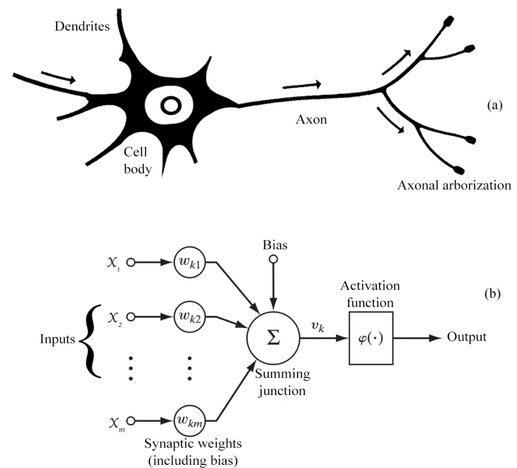

# Introduction to Threshold Logic Unit (TLU): Biology, Mathematics, and Python Implementation

## Introduction

Artificial intelligence and neural networks are inspired by biological neurons. One of the simplest artificial neuron models is the **Threshold Logic Unit (TLU)**, which forms the foundation of perceptrons and modern deep learning architectures. In this post, we will explore the biological origins, mathematical formulation, and a practical Python implementation of the **TLU**. That's a great starting point to understand artificial neurons and the foundation of deep learning. Don't be afraid by the complexity, it's a great place to start.

## Biological Inspiration

The **TLU** is inspired by the behavior of biological neurons. A neuron in the human brain receives inputs from other neurons through synapses. If the combined signal exceeds a certain threshold, the neuron fires and sends a signal to the next neuron.

In simple terms:

- Neurons receive **input signals**.

- Each input is weighted based on its importance.

- If the **weighted sum** of inputs exceeds a **threshold**, the neuron activates.

This is a **binary activation system**, where the neuron either fires (`1`) or remains inactive (`0`).



- $(a)$ : Biological Neuron
- $(b)$ : Artificial Neuron

---

## Mathematical Model

A **Threshold Logic Unit** (TLU) is mathematically defined as:

\[
    y = f(w_1 x_1 + w_2 x_2 + \dots + w_n x_n - \theta)
\]

where:
- \( x_i \) are the input values.
- \( w_i \) are the corresponding weights.
- \( \theta \) is the threshold.
- \( f(z) \) is the step activation function:

\[
    f(z) = \begin{cases} 
      1 & \text{if } z \geq 0 \\
      0 & \text{otherwise}
    \end{cases}
\]

This function determines whether the neuron fires (`1`) or stays inactive (`0`).

---

## Python Implementation

Let's implement a simple **Threshold Logic Unit (TLU)** in Python.

```python
import numpy as np

def step_function(x):
    return 1 if x >= 0 else 0

def TLU(inputs, weights, threshold):
    weighted_sum = np.dot(inputs, weights) - threshold
    return step_function(weighted_sum)

# Example usage:
inputs = np.array([1, 0, 1])   # Binary inputs
weights = np.array([0.5, 0.5, 0.5])  # Weight vector
threshold = 0.7

output = TLU(inputs, weights, threshold)
print(f"TLU Output: {output}")
```

### Explanation:
1. The `step_function(x)` returns `1` if `x` is greater than or equal to zero, otherwise `0`.
2. The `TLU(inputs, weights, threshold)` computes the **weighted sum**, subtracts the threshold, and applies the step function.
3. We test it with a simple example where `inputs = [1, 0, 1]`, `weights = [0.5, 0.5, 0.5]`, and `threshold = 0.7`.

## Visualization of Decision Boundary

A **TLU** is a **linear classifier**, meaning it can separate data with a straight decision boundary. Let's visualize this boundary using Matplotlib.

```python
import matplotlib.pyplot as plt

def plot_tlu_decision_boundary(weight, threshold):
    x = np.linspace(-2, 2, 100)
    y = (-weight[0] * x + threshold) / weight[1]
    plt.plot(x, y, label="Decision Boundary")
    plt.axhline(0, color='gray', linestyle='--')
    plt.axvline(0, color='gray', linestyle='--')
    plt.xlim(-2, 2)
    plt.ylim(-2, 2)
    plt.xlabel("x1")
    plt.ylabel("x2")
    plt.legend()
    plt.title("TLU Decision Boundary")
    plt.show()

# Example decision boundary
weights = np.array([0.5, -0.5])
threshold = 0.2
plot_tlu_decision_boundary(weights, threshold)
```

## Limitations of TLU

While the **Threshold Logic Unit** is a fundamental concept, it has limitations:
- It can only solve **linearly separable problems** (like AND and OR logic gates).
- It **fails** for problems like XOR, which are **not linearly separable**.
- More advanced models like **Perceptrons** and **Multi-Layer Neural Networks** extend this idea by using different activation functions and multiple layers.

## Conclusion

The **TLU** is a great starting point to understand artificial neurons and the foundation of deep learning. Even though modern neural networks use **non-linear activation functions** like sigmoid, ReLU, and tanh, understanding **TLU** provides fundamental insights into how neurons process information.

In future posts, we will extend this idea to **Perceptrons** and **Neural Networks**.

---

### References
- Rosenblatt, F. (1958). The Perceptron: A Probabilistic Model for Information Storage and Organization in the Brain.
- McCulloch, W. S., & Pitts, W. (1943). A logical calculus of the ideas immanent in nervous activity.

---


